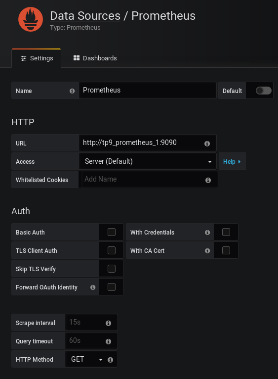
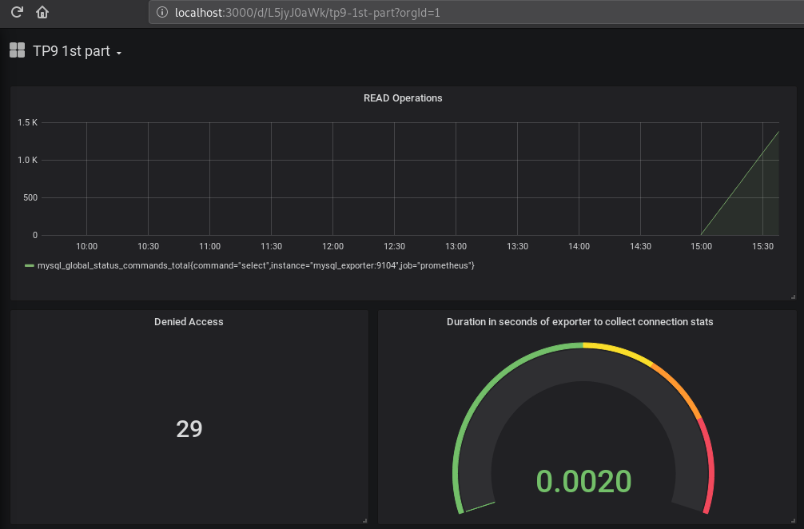
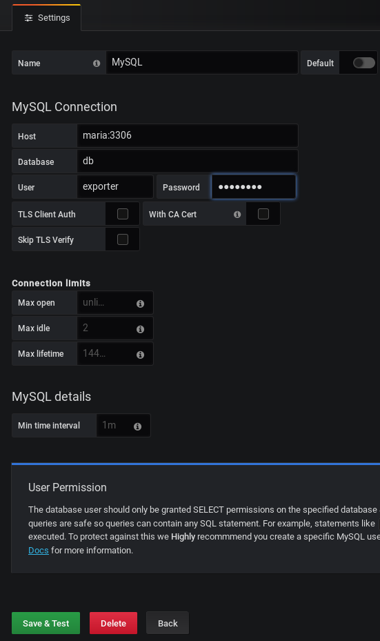
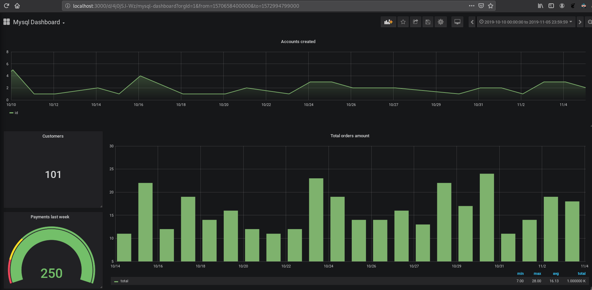
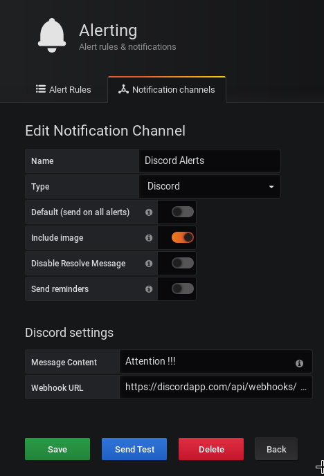
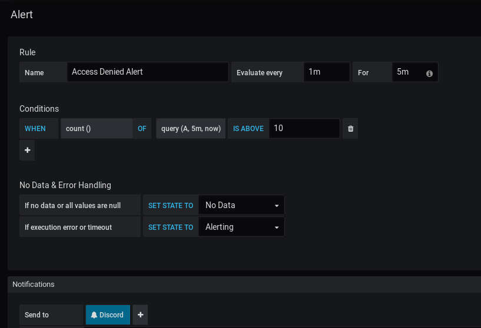
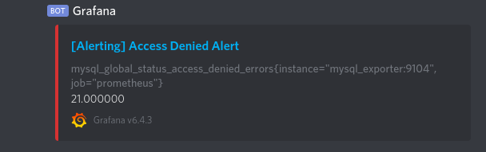

# TP9 + TP10

## TP9

Créer des Dashboards avec Grafana

### 1 - Docker-Compose

```
version: '3.7'

services:
  maria:
    image: mariadb:10.4
    restart: on-failure
    environment:
     MYSQL_ROOT_PASSWORD: root
     MYSQL_DATABASE: test
    volumes:
     - ./maria_data:/var/lib/mysql
    ports:
     - "3306"

  prometheus:
    image: prom/prometheus
    restart: on-failure
    ports:
     - "9090:9090"
    volumes:
     - ./prometheus.yml:/etc/prometheus/prometheus.yml

  mysql_exporter:
    image: prom/mysqld-exporter
    restart: on-failure
    ports:
     - "9104:9104"
    environment:
     - "DATA_SOURCE_NAME=exporter:password@(maria:3306)/"

  grafana:
    image: grafana/grafana:6.4.3
    ports:
      - "3000:3000"
```

### 2 - Ajouter la source



### 3 - Dashboard



### 4 - Importer le dump

Modification du docker-compose avec un dossier db pour les dumps :
```
volumes:
     - ./maria_data:/var/lib/mysql
     - ./db:/db
```

On place le fichier sql dans notre dossier db, ensuite on se connecte à la machine pour importer le dump :

```
root@368f249dc0e0:/db# mysql -uroot -proot
MariaDB [(none)]> create database db;
MariaDB [(none)]> exit
root@368f249dc0e0:/db# mysql -uroot -p db < sylius_dev.sql
```

On ajoute la source dans grafana :



### 5 - Dashboard



## TP10

### 1 - Ajout du channel



Dans Discord : Servers settings -> Webhooks

### 2 - Alerte customisée + envoi sur le channel




